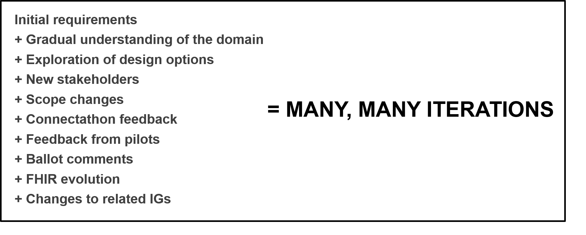
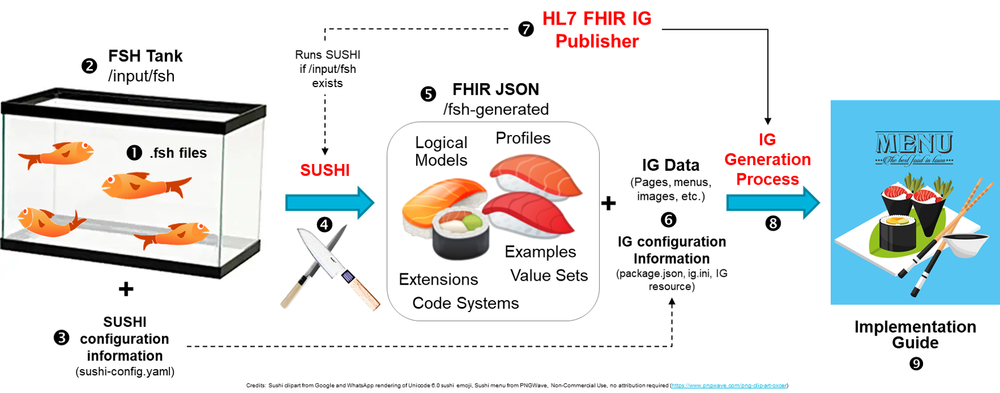

FHIR Shorthand (FSH) is a domain-specific language (DSL) for defining the contents of FHIR Implementation Guides (IG). The language is specifically designed for this purpose, simple and compact, and allows the author to express their intent with fewer concerns about underlying FHIR mechanics. FSH can be created and updated using any text editor, and because it is text, it enables distributed, team-based development using source code control tools such as Github.

Accompanying the FSH language is a reference implementation, [SUSHI](sushi), that translates FSH into FHIR artifacts and enables production of FHIR IGs. There is also a new tool, [FSH Food](https://github.com/lantanagroup/fshfood), that converts profiles and extensions (StructureDefinitions) into FSH. Together with the [HL7 IG Publisher](https://confluence.hl7.org/display/FHIR/IG+Publisher+Documentation), these tools present a complete solution for creating and maintaining a FHIR IG.

> **Note:** HL7® and FHIR® are registered trademarks owned by Health Level Seven International.

#### Motivations for FHIR Shorthand

FHIR Shorthand was created in response to the need in the FHIR community for scalable, fast, user-friendly tools for IG creation and maintenance. Experience has shown that profiling projects can be difficult and slow, and the resulting IG quality can be inconsistent. Profiling projects often go through many iterations, and as such, an agile approach to refactoring and revision is invaluable.

There are already several existing methods for IG creation: hand editing, using [Excel spreadsheets](https://confluence.hl7.org/display/FHIR/FHIR+Spreadsheet+Profile+Authoring), [Simplifier/Forge](https://fire.ly/products/simplifier-net/), and [Trifolia-on-FHIR](https://trifolia-fhir.lantanagroup.com). Each of these methods have advantages and drawbacks:

1. Hand-editing StructureDefinitions (SDs) is unwieldy, but authors get full control over every aspect of the resulting profiles and extensions.
1. The spreadsheet method has existed since before FHIR 1.0 and has been used to produce sophisticated IGs such as [US Core](https://github.com/HL7/US-Core-R4). A significant downside is that version management is next to impossible; either the files are saved as binary (.xslx) or as voluminous XML files, content lost in thousands of lines of formatting.
1. Simplifier/Forge and Trifolia-on-FHIR improve this situation by adding graphical interfaces, but these tools are not particularly agile when it comes to [refactoring](https://resources.collab.net/agile-101/code-refactoring), and at least currently, source code control (SCC) features are not well supported.

Experience has shown that complex software projects are best approached with textual languages. As a DSL designed for the job of profiling and IG creation, FSH is concise, understandable, and aligned to user intentions. User may find that the FSH language representation the best way to understand a set of profiles. Because it is text-based, FHIR Shorthand brings a degree of editing agility not found in graphical tools. FSH is ideal for distributed development under source code control, providing meaningful version-to-version differentials, support for merging and conflict resolution, and nimble refactoring. These features allow FSH to scale in ways that other approaches cannot. Any text editor can be used to create or modify FSH.

#### About this IG

This implementation guide includes the following sections:

* [FHIR Shorthand Overview](index.html) (this document) -- A high level overview of FSH
* [FHIR Shorthand Tutorial](tutorial.html) -- A step-by-step hands-on introduction to producing an IG with FHIR Shorthand.
* [FHIR Shorthand Language Reference](reference.html) -- The syntax and usage of the FHIR Shorthand language
* [SUSHI User Guide](sushi.html) -- How to produce an IG from FSH files using SUSHI compiler and the IG Publisher

### Creating an IG with FHIR Shorthand

Creating an IG with FSH consists of three steps:

1. Populate a FSH Tank with FSH files containing definitions of FHIR artifacts, and any additional content for your IG.
2. Compile those files using the SUSHI compiler
3. Create the IG using the HL7 FHIR IG Publishing Tool

This is process illustrated below:

#### FSH Tanks and FSH Files

A **FSH Tank** is a directory that contains FSH files. A FSH Tank corresponds one-to-one to an IG and represents a complete module that can be placed under SCC. The FHIR artifacts included in the IG (profiles, extensions, value sets, examples, etc.) are defined by `.fsh` files the FSH Tank. Any other FHIR artifacts (such as profiles from another IG) are "external" and must be declared in dependencies.

Information in FSH is stored in plain text files with `.fsh` extension. Each file can contain multiple items. It is up to the author to decide how to divide information between the between FSH files. Here are some possibilities:

* Divide up different type of items: profiles in one file, value sets in another, extensions in another, etc.
* Group things logically, for example, a profile together with its value sets, extensions, and examples.
* Use one file for each item

Additional IG content is also part of the FSH Tank (the rice and seaweed in the illustration). This typically includes the narrative page content of your IG, images, and customized menus.

#### Running SUSHI

You can run SUSHI to test your FSH definitions anytime. SUSHI software is downloaded and runs locally on your own computer (although not implemented, the underlying architecture allows for future server-based deployment). SUSHI is executed from the command line. Installing and running SUSHI is described [here](sushi).

After SUSHI runs (usually only a few seconds), a new directory (called "build" by default) appears in the FSH Tank. This directory contains all the files necessary to run the IG Publisher. The artifacts, such as profiles, extensions, value sets, and instances can be found in the _/build/input_ directory after running SUSHI.

#### Running the IG Publisher

The IG Publisher can be run from the command line, directly after running SUSHI, populating the _/build/output_ directory. The generated file _/build/output/index.html_ is the home page for the IG. It can be opened in any browser.

If you are creating an HL7 IG, you need to move the build files (excluding /build/output, /build/temp, and /build/template) to your IG repository on hl7.github.com. When you copy the build files to the HL7 repository, the IG Publisher will run automatically, and your IG will appear on the continuous integration site, _https://build.fhir.org_.

### Shorthand Language Overview

#### 